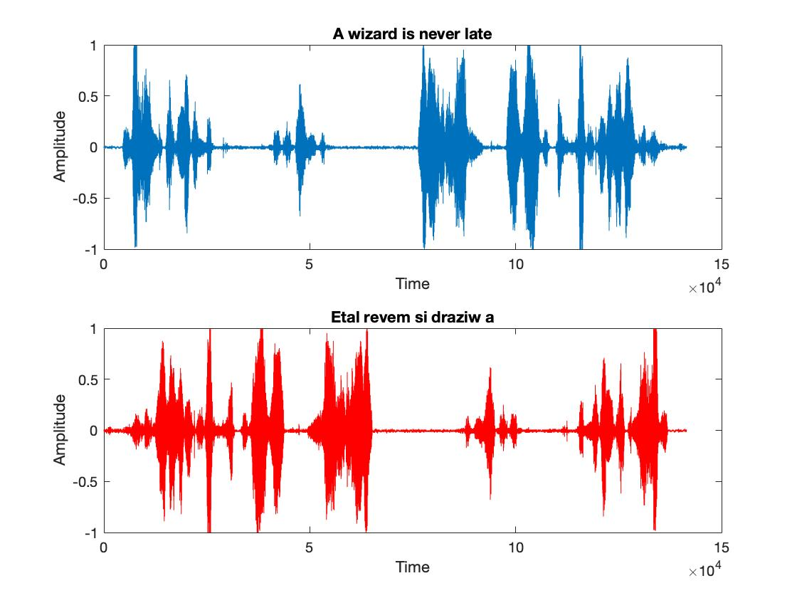

# sound processing in matlab

## bg
sound = wave of air particles
- not a sine wave (transverse wave) but a longitudinal wave (sound travels through air and compresses out eardrums)
- sound in processing is a transverse wave when in reality it is a longitudinal wave
- sound data stored in an array of samples
    - sampling = discretization of data points along x-axis(time) or y-axis
    - stored in 32 / 64 bit so you can't have a super precise value but it's impreceptible

## .wav
- raw digital sound data quantized into an array
- func wavread is  deprecated
- size(wavdata) returns {numsamples     numchannels}

## channels
- recording in stereo : 2 channels
    - size(d) =  8500 <span style="background-color: #FFCOCB">2</span>

## play back
```matlab
sampling rate = fs, data = d
[d, fs] = waveread('nameofwav.wav')
            or
[d, fs] = audioread('nameofwav.wav')
sound(d, fs) //play the file
```

## flip sample
```matlab
//ex sound file size(d) = 85000 2
d2 = flipud(d); //reverse the sound
d3 = fliplr(d); //flip channels
```

## test



## fs
```matlab
sound(d); //play at default sample rate of 8192 Hz
```
downsampling - speeding up a sound wave, playing at higher fs
- dropping every other sample of the original signal 
```matlab
d4 = downsample(d, 2)
size(d4) = 42240 2 //size now half the original - information loss

//How to play at normal speed now that we half half the samples
sound(d4, fs/2)
```

## fourier transform
- lets you view frequency components of a signal: sig time domain -> frequency domain
- reverse fourier transform: frequency domain -> time domain
- FFT (fast fourier transform) calc fourier transform in O(N*logN) as opposed to O(N<sup>2</sup>)
- fourier transform is periodic (repeats every 2pi - symmetric about 0)

## fft
```matlab
x = linspace(0, 5*pi, 1000);
y = sin(x)
Y = fft(y)
plot(Y) //plot transformed signal - doesn't give us what we want
//transormed signal has a real and imaginary part. We just want the real part
plot(real(Y))

//transformed signal size is the same as original signal
// size(Y) == size(y)

//analyse sound signals that you want to know frequencies about
D = fft(d(:,1); //: = select all columns
plot(real(D)); //see range of frequencies
```
## spectrogram
short time fourier transform
- 2d heat map/contour plot, time x frequency
- how main frequency component changes with time
```matlab
x = linspace(0, 10*pi, 5000);
plot(real(fft(sin(x))))
y2 = sin(x.*x);
spectrogram(y2, 500) //with window parameter
```
uncertainty: 
- larger window of time -> less accurate frequency
- smaller window of time -> accurate frequency

## low pass filters
what is is supposed to sound like?
```matlab
x = linsapce(0, 5*pi, 10000);
y = sin(x)
sound(y, 44100) //sound at 1 frequency sounds like a short buzz
sound(y, 22050) //sounds lower pitched at lower sampling frequency
```
low pass filters silence higher frequencies based on multipliers applied to og sig
```matlab
b = ones(40,1)/40; //matrix 1/40 40 times
[d,fs] = audioread('filename.wav');
dlp = filter(b, 1, d); 

//low pass filter sounds muffled bc high frequencies can't pass (like a wall))
sound(d, fs)
sound(dlp, fs)

//compare signal variation
xaxis = 1:84480;
plot(xaxis,d,xaxis,dlp)
//compare frequencies
subplot(2,1,1)
//NOTE you should take the magnitude of the square of the real and im parts
//the real alone gives an impartial picture
// do sqrt(real^2 + im^2)
plot(real(fft(d)))
subplot(2,1,2)
plot(real(fft(dlp))
```

## high pass filter
implement sing filter()
